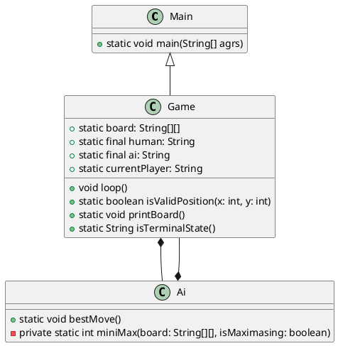

```plantuml

@startuml

Main <|-- Game
Ai *-- Game
Game *-- Ai

class Ai {
    + static void bestMove()
    - private static int miniMax(board: String[][], isMaximasing: boolean)
}

class Game {
    + static board: String[][]
    + static final human: String
    + static final ai: String
    + static currentPlayer: String

    + void loop()
    + static boolean isValidPosition(x: int, y: int)
    + static void printBoard()
    + static String isTerminalState()
}

class Main {
    + static void main(String[] agrs)
}

@enduml

```