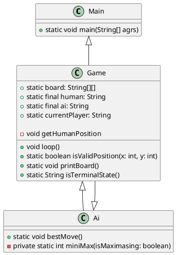

# **\~_Documentation_\~**

1. Project overview 
2. Solution Idea
3. Class Diagram
4. Implementation

<br/>
<br/>
<br/>


## **1. Project Overview**

In this project the user/human can play TicTacToe against an AI. It is a terminal game, that means there is no GUI. The implementation is in Java with JUnit4 for testing. 

<br/>
<br/>


### `Rules for TicTacToe`:
Two playeers are playing against each other. There is a game board with three rows and three colums:

```
                                                         | |
                                                        -----
                                                         | |
                                                        -----
                                                         | |
```

That means that there a nine free fields. Both player have their own Symbol: **`X`** or **`O`**. One after another select a empty field and fills it with his own Symbol. <br />

Both players can win by have three of there symbols horizontal/vertical or diagonal side by side and not blocking by the symbol of the other player. 

For example:

```
                X|X|X                       |       X| |                      |         X| |
                -----                       |       -----                     |         -----
                O| |O  ← X wins             |       X|O|O ← X wins            |         O|X| ← X wins
                -----                       |       -----                     |         -----
                 |O|                        |       X|O|                      |         O|O|X
```

When there is no more empty space and none of the two players won, the game is over and it´s a tie.

<br/>

## **2. Solution Idea**

The game concept is clear. But how does the AI works?
Because after the player makes a move the AI needs to eveluate the best possible move. 
For this problem I use the Minimax-Algorithmus. This algorithmus has two players. The **`Min`** and **`Max`**. <br />
The **`Max`** player tries to max his score and the **`Min`** player tries to min his score. The algorithmus goes through all possible combinations up to a terminal state. A terminal state is a state in which the board is completly filled or one player wins. Then it gives each possible combinations a score. <br />
<br />
These scores are possible:

- 1  -> **`Max`** player wins
- -1 -> **`Min`** player wins
- 0  -> tie

The AI is the max player so it tries to maximaze his score. So the AI select the move which leads to a win for the AI. Or if this is not possible the AI tries to get a tie. <br />
For the AI it´s allways possible to get a tie, that means that the human, which plays against the AI, can´t win, even if he starts.

<br/>


## **3. Class diagram**

<br />
<br />




<br />
<br />
<br />


## **4. Implementation**

First I start by creating in the **`main method`** a new game. 

```java
1   package TicTacToeAI;
2    
3   public class Main {
4       public static void main(String[] args) {
5           Game game = new Game();
6           game.loop();
7       }
8
9   }
```

### **`Game`** contains the following attributes:

<br />

The 2d Array board, which contains the symbols by the players and the emtpy spaces. By default the whole board is empty
```java
7   public static String[][] board = {
8               { " ", " ", " " },
9               { " ", " ", " " },
10              { " ", " ", " " }
11  };
```

<br />

The symbol for the human as a not changeable constante
```java
12  public static final String HUMAN = "O";
```
<br />

The symbol for the AI as a not changeable constante
```java
13  public static final String AI = "X";
```
<br />

The symbol for the current player, which also mean the player, which stats the game
```java
14  public static String currentPlayer = HUMAN;
```
<br />

This Array stores the position the human gives as a input for his symbol in the board
```java
15  private int[] humanPosition;
```

<br />

All of them except for the **`humanPosition`** are static. This is needed because the AI uses all of them and implement all of them as parameters would not be that clean.

<br />

After that in the **`main method`** the object **`game`** uses the method **`loop`**
to launch the game.

<br />
The while loop stops when there is a terminal. If not in a terminal state the human or the KI makes their move

<br />

```java
31  public void loop() {
32
33      while (true) {
34          ...
56      }
57  }
```

<br />

But first the board gets printed by usiung the method **`printBoard`**

<br />

```java
32  ...
33  while (true) {
34      printBoard();
35  ...      
56  }
57  ...
```

<br />
This is the method for printing out the board: 

<br />

```java
68  public static void printBoard() {
69      System.out.println("\n");
70      System.out.println(board[0][0] + " | " + board[0][1] + " | " + board[0][2]);
71      System.out.println("---------");
72      System.out.println(board[1][0] + " | " + board[1][1] + " | " + board[1][2]);
73      System.out.println("---------");
74      System.out.println(board[2][0] + " | " + board[2][1] + " | " + board[2][2]);
75      System.out.println("\n");
76
77  }
```

<br />

After printing the board, it needs to be checked if the game is over. 
To accomplish that the method **`isTerminalState`** checks if there is a terminal state.
If there is a terminal state the winner or tie gets printed and the loop stops and the game is over.

<br />

```java
32  ...
33  while (true) {
34      printBoard();
35
36      // check if game if over
37      String state = isTerminalState();
38      if (state != null) {
39          if (state == "tie") {
40              System.out.println(state);
41              break;
42          }
43          System.out.println(state + " wins");
44          break;
45      }
46      ...
56  }
57  ...    

```

<br />

First the method **`isTerminalState`** loops over the the rows and checks if in the rows are only the same symbols. If this is true, the symbol of the winner gets returned.

<br />

```java
79  public static String isTerminalState() {
80      // check rows
81      for (int row = 0; row < 3; row++) {
82          if (board[row][0] == board[row][1] && board[row][1] == board[row][2] && board[row][1] != " ") {
83              return board[row][0];
84          }
85      }
86      ...
109 }

```

<br />

The same prinzip is used for the colums.

<br />

```java
86      ...
87      // check columns
88      for (int column = 0; column < 3; column++) {
89          if (board[0][column] == board[1][column] && board[1][column] == board[2][column]
90                  && board[1][column] != " ") {
91              return board[0][column];
92          }
93      }
94      ...
```

<br />

After the rows and colums the diagonals needs to be checked.

<br />

```java
94      ...
95      // check diagonal
96      if (((board[0][0] == board[1][1] && board[1][1] == board[2][2])
97              || (board[0][2] == board[1][1] && board[1][1] == board[2][0])) && board[1][1] != " ") {
98          return board[1][1];
99      }
100     ...
```

<br />


And finally the check for a tie. It loops over the field and if one field is empty, the method returns null, which means the game is not over. Else the method returns a tie.

<br />

```java
100       ...
101       for (int row = 0; row < 3; row++) {
102           for (int column = 0; column < 3; column++) {
103               if (board[row][column] == " ") {
104                   return null;
105               }
106           }
107       }
108       return "tie";
109       ...
 
```

<br />

If the game is not over the human or the AI can make a move. If the human is the current player the method **`getHumanPositions`** gets called. After that on the correct positon the symbol of the human is set and the **`currentPlayer`** gets the new value of **`AI`**. <br />
If it´s AI´s turn the static method of the AI class gets called and after that the **`currentPlayer`** gets the new value of **`HUMAN`**.

<br />

```java
31  public void loop() {
32 
33      while (true) {
34          ...
47          // human and KI make a move
48          if (currentPlayer == HUMAN) {
49              getHumanPosition();
50              board[humanPosition[0]][humanPosition[1]] = HUMAN;
51              currentPlayer = AI;
52          } else {
53              Ai.bestMove();
54              currentPlayer = HUMAN;
55          }
56      }
57  }
```

<br />

This is the **`getHumanPositions`** method. In a while loop the human select a **row** and **column** cordinate for his symbol. This position on the board gets checked by the **`isValidPosition`** method. If the position is valid the while loop stops.

<br />

```java
17  private void getHumanPosition() {
18      while (true) {
19          Scanner userInput = new Scanner(System.in);
20          System.out.println("\nrow:");
21          int row = userInput.nextInt() - 1;
22          System.out.println("column:");
23          int column = userInput.nextInt() - 1;
24          if (isValidPosition(row, column)) {
25              humanPosition = new int[] { row, column };
26              break;
27          }
28      }
29  }

```

<br />

The **`isValidPosition`** method checks if the positon by the user input is empty, that means free and not out of the board range. If that is true the method return true, else it returns false.

<br />

```java
59  public static boolean isValidPosition(int row, int column) {
60      if (row < 3 && column < 3 && row >= 0 && column >= 0) {
61          if (board[row][column] == " ") {
62              return true;
63          }
64      }
65      return false;
66  }
```

<br />

That was the human turn. But what if the AI needs to pick a move. <br />
The static method **`bestMove`** gets called. <br />
First the method initialized **`bestScore`** and **`move`**. **`bestScore`** is set to negative infitiy. Every time a new score is greater than **`bestScore`**, the value gets overried. <br />
**`move`** is used at the end to make the final move for the AI. It contains the row and column value.

<br />

```java
5   public static void bestMove() {
6      int bestScore = Integer.MIN_VALUE;
7      int[] move = new int[2];
8      ...
26  }
```

<br />

After that the method iterate over the board and finds all empty slots. For this empty slots it calles the **`miniMax`** method and eveluate a score for this move. If the score is greater than the **`bestScore`**, the value gets overried and the array **`move`** gets their row and column value. <br />
At the end the best possible move gets selected and the AI set the symbol on this position.

<br />

```java
7        ...
8
9       for (int row = 0; row < 3; row++) {
10          for (int column = 0; column < 3; column++) {
11              if (Game.board[row][column] == " ") {
12                  Game.board[row][column] = Game.AI;
13                  int score = miniMax(false);
14                  Game.board[row][column] = " ";
15
16                  // new best move
17                  if (score > bestScore) { 
18                      bestScore = score;
19                      move[0] = row;
20                      move[1] = column;
21                  }
22              }
23          }
24      }
25      Game.board[move[0]][move[1]] = Game.AI; // AI do the move
```

<br />

So the **`miniMax`** method eveluate the score. But how? <br />
By iterate through all the possible next moves up to a terminal state. It switches between the all moves of the human and the AI. Then all of this possible future outcomes gets one of the scores: 1, -1 or 0. <br />
1 means KI wins, -1 human wins and 0 tie. 
The **`miniMax`** method returns the score of the best possible outcome. 

```java
28  private static int miniMax(boolean isMaximasing) {
29      // is game over
30      if (Game.isTerminalState() != null) {
31          return scores(Game.isTerminalState());
32      }
33        
34      if (isMaximasing) {
35          int bestScoreMax = Integer.MIN_VALUE;
36          for (int row = 0; row < 3; row++) {
37              for (int column = 0; column < 3; column++) {
38                  if (Game.board[row][column] == " ") {
39                      Game.board[row][column] = Game.AI;
40                      int scoreMax = miniMax(false);
41                      Game.board[row][column] = " ";
42                      bestScoreMax = Math.max(scoreMax, bestScoreMax);
43                  }
44              }
45          }
46          return bestScoreMax;
47      } else {
48          int bestScoreMin = Integer.MAX_VALUE;
49          for (int row = 0; row < 3; row++) {
50              for (int column = 0; column < 3; column++) {
51                  if (Game.board[row][column] == " ") {
52                      Game.board[row][column] = Game.HUMAN;
53                      int scoreMin = miniMax(true);
54                      Game.board[row][column] = " ";
55                      bestScoreMin = Math.min(scoreMin, bestScoreMin);
56                  }
57              }
58          }
59          return bestScoreMin;
60      }
61  }
62
63    private static int scores(String result) {
64        if (result == "X") {
65            return 1;
66        } else if (result == "O") {
67            return -1;
68        } else {
69            return 0;
70        }
71    }
```