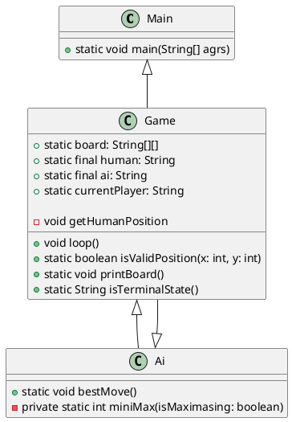

# **\~_Documentation_\~**

1. Project overview 
2. Solution Idea
3. Class Diagram
4. Implementation

<br/>
<br/>
<br/>


## **1. Project Overview**

In this project the user/human can play TicTacToe against an AI. It is a terminal game, that means there is no GUI. The implementation is in Java with JUnit4 for testing. 

<br/>
<br/>


### `Rules for TicTacToe`:
Two playeers are playing against each other. There is a game board with three rows and three colums:

```
                                                         | |
                                                        -----
                                                         | |
                                                        -----
                                                         | |
```

That means that there a nine free fields. Both player have their own Symbol: **`X`** or **`O`**. One after another select a empty field and fills it with his own Symbol. <br />

Both players can win by have three of there symbols horizontal/vertical or diagonal side by side and not blocking by the symbol of the other player. 

For example:

```
                X|X|X                       |       X| |                      |         X| |
                -----                       |       -----                     |         -----
                O| |O  ← X wins             |       X|O|O ← X wins            |         O|X| ← X wins
                -----                       |       -----                     |         -----
                 |O|                        |       X|O|                      |         O|O|X
```

When there is no more empty space and none of the two players won, the game is over and it´s a tie.

<br/>

## **2. Solution Idea**

The game concept is clear. But how does the AI works?
Because after the player makes a move the AI needs to eveluate the best possible move. 
For this problem I use the Minimax-Algorithmus. This algorithmus has two players. The **`Min`** and **`Max`**. <br />
The **`Max`** player tries to max his score and the **`Min`** player tries to min his score. The algorithmus goes through all possible combinations up to a terminal state. A terminal state is a state in which the board is completly filled or one player wins. Then it gives each possible combinations a score. <br />
<br />
These scores are possible:

- 1  -> **`Max`** player wins
- -1 -> **`Min`** player wins
- 0  -> tie

The AI is the max player so it tries to maximaze his score. So the AI select the move which leads to a win for the AI. Or if this is not possible the AI tries to get a tie. <br />
For the AI it´s allways possible to get a tie, that means that the human, which plays against the AI, can´t win, even if he starts.

<br/>


## **3. Class diagram**

<br />
<br />




<br />
<br />
<br />


## **4. Implementation**

First I start by creating in the **`main function`** a new game. 

```java
package TicTacToeAI;

public class Main {
    public static void main(String[] args) {
        Game game = new Game();
        game.loop();
    }

}
```

### **`Game`** contains the following attributes:

<br />

The 2d Array board, which contains the symbols by the players and the emtpy spaces. By default the whole board is empty
```java
public static String[][] board = {
            { " ", " ", " " },
            { " ", " ", " " },
            { " ", " ", " " }
    };
```

<br />

The symbol for the human as a not changeable constante
```java
public static final String HUMAN = "O";
```
<br />

The symbol for the AI as a not changeable constante
```java
public static final String AI = "X";
```
<br />

The symbol for the current player, which also mean the player, which stats the game
```java
public static String currentPlayer = HUMAN;
```
<br />

This Array stores the position the human gives as a input for his symbol in the board
```java
private int[] humanPosition;
```

<br />

All of them except for the **`humanPosition`** are static. This is needed because the AI uses all of them and implement all of them as parameters would not be that clean.